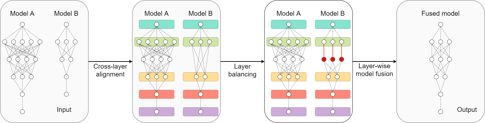

# CLAFusion


This repository is the official implementation of our ICASSP 2023 paper [On Cross-Layer Alignment for Model Fusion of Heterogeneous Neural Networks](https://arxiv.org/abs/2110.15538).



Details of the model architecture and experimental results can be found in our paper:
```
@article{nguyen2021model,
  title={On Cross-Layer Alignment for Model Fusion of Heterogeneous Neural Networks},
  author={Nguyen, Dang and Nguyen, Trang and Nguyen, Khai and Phung, Dinh and Bui, Hung and Ho, Nhat},
  journal={arXiv preprint arXiv:2110.15538},
  year={2021}
}
```
Please CITE our paper whenever this repository is used to help produce published results or incorporated into other software.

This implementation is made by Dang Nguyen. README is on updating process.


## Requirements 

We use Python 3.6. To install requirements:

```setup
pip install -r requirements.txt
```

Other than that, the bc command is needed to run bash scripts.

```setup
apt-get install bc libsndfile1
```

## How to use this repository
We prepared bash scripts for running experiments in the paper in folder **sh**. Before running any scripts, **be sure to put the model checkpoints in the correct directory specified in the DATA_PATH variable.** 

You can conduct your experiments by changing the parameters in the corresponding script or creating a new one. Parameter description is available in parameters.py.

## Training

To train the model(s) in the paper, run this command:
* RESNET
```
bash sh/train_resnet18_resnet34.sh
```
* VGG
```
bash sh/train_vgg11_half_vgg13_doub.sh
```
* Ablation studies
```
bash sh/train_mlp_ablation_studies.sh
```
* Skill transfer
```
bash sh/train_mlp_p_split.sh
```

## CLAFusion
To fuse the model(s) in the paper, run this command:
* Ablation studies
```
bash sh/align_mlp_ablation_studies.sh
bash sh/fuse_mlp_ablation_studies.sh
```
* Skill transfer
```
bash sh/fuse_mlp_p_spit.sh
```

## CLAFusion + Finetuning
To fuse + finetune the model(s) in the paper, run this command:
* RESNET18 + RESNET34
```
bash sh/fuse_resnet18_resnet34.sh
bash sh/fuse_4_resnet.sh
bash sh/fuse_6_resnet.sh
```
* Teacher-student setting
```
bash sh/fuse_vgg11_half_vgg13_doub.sh
bash sh/fuse_resnet18_half_resnet34.sh

```

## Heterogeneous model transfer
To transfer RESNET18 to RESNET34, run this command:
```
bash sh/transfer_resnet18_resnet34.sh
```

## Knowledge distillation
To run knowledge distillation experiment:
```
bash sh/distill_vgg.sh
bash sh/distill_vgg_small.sh
bash sh/distill_resnet.sh
bash sh/distill_resnet_small.sh
```

## Pre-trained Models

You can download pre-trained models at the following link, [My pre-trained models](https://bit.ly/3uUe7t4). 
Please do not modify or delete files in this folder.
Please do not share the link with unauthorized people. 

## Results

Our models achieve the average performance (across 5 different seeds) as follows.

| Exp name                          | Model A | Model B |
| --------------------------------- | ------- | ------- |
| RESNET34 + RESNET18 (CIFAR10)     |  93.31  |  92.92  |
| RESNET34 + RESNET18 (CIFAR100)    |  65.93  |  65.33  |
| Teacher-student VGG (CIFAR010)    |  92.65  |  89.72  |
| Teacher-student RESNET (CIFAR100) |  65.93  |  61.53  |
| Ablation study (MLP)              |  96.95  |  97.75  |
| Skill transfer                    |  90.76  |  87.58  |

## Contributing
If you'd like to contribute or have any suggestions, you can contact us at nguyentuanhaidang@gmail.com or open an issue on this GitHub repository.

All contributions are welcome! All content in this repository is licensed under the MIT license.

## Acknowledgment
The structure of this repository is largely based on the official implementation of [Model Fusion via Optimal Transport](https://github.com/sidak/otfusion). For model transfer, we adapt the source code of [Heterogeneous Model Transfer between Different Neural Networks](https://anonymous.4open.science/r/6ab184dc-3c64-4fdd-ba6d-1e5097623dfd/a_hetero_model_transfer.py). We are grateful for their open sources.